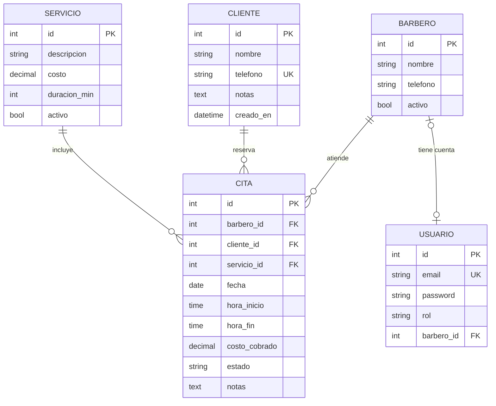

# Modelo de datos

Cinco tablas: las cuatro de la agenda (barbero, cliente, servicio, cita) y la de usuarios para iniciar sesión. `cita` es la tabla central.

## Restricciones

| Tabla | Restricción | Regla |
| --- | --- | --- |
| cliente | `telefono` único, exactamente 10 dígitos | RN-05 |
| servicio | `costo >= 0`; `duracion_min` múltiplo de 15 | RN-02 |
| cita | `hora_fin > hora_inicio` | RN-02 |
| cita | Sin traslape por barbero en citas no canceladas (`ExclusionConstraint`) | RN-01 |
| cita | `estado` en: programada, atendida, cancelada, no_asistio | RF-08 |
| cita | Índice por (`barbero_id`, `fecha`) para la agenda del día | RNF-02 |

## Convenciones de Django que adoptamos

Al elegir Django ([ADR-0001](../03-decisiones/adr-0001-django-drf.md)) seguimos sus convenciones en lugar de inventar las nuestras:

- La llave primaria se llama `id`, no `id_barbero`.
- Una llave foránea se declara como `barbero` en el modelo y Django crea la columna `barbero_id`. En la API el campo se llama `barbero`.
- El usuario es un **modelo de usuario personalizado** (hereda de `AbstractUser`) creado en la primera migración, con el campo `rol`. Cambiarlo después es muy costoso; por eso se hace desde el día uno.
- Las bajas son lógicas (`activo = False`): nunca se borra un barbero o servicio con historial.

> Pendiente: actualizar en Figma los nombres de capa de P03 (`cita.id_servicio` → `cita.servicio`, `cita.id_barbero` → `cita.barbero`).

## Preguntas para pensar (no las responda la IA por ti)

- ¿Por qué copiamos el costo a `cita.costo_cobrado` en lugar de leerlo siempre de `servicio`?
- ¿Qué pasaría con el historial si borráramos un barbero en vez de marcarlo inactivo?
- ¿Qué gana el equipo validando RN-01 también en PostgreSQL si ya se valida en Django?
