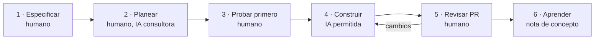

# Metodología: SDD ligero en sprints de una semana

Trabajamos con **Spec-Driven Development ligero**: las personas definen qué se construye y por qué; la IA ayuda a construirlo; las pruebas y las revisiones demuestran que funciona y que lo entendemos. Lo organizamos en sprints de una semana. Decisión registrada en [ADR-0003](../03-decisiones/adr-0003-metodologia-sdd.md).

> No reconstruimos la rueda, pero sabemos por qué gira.

## El ciclo de cada funcionalidad

| Paso | Qué se hace | Qué queda en el vault o repo | Papel de la IA |
| --- | --- | --- | --- |
| 1 · Especificar | Problema, historia de usuario, criterios Dado/Cuando/Entonces, fuera de alcance | Spec en `02-specs/` | Solo revisa: `/revisar-spec` |
| 2 · Planear | Responder el plan técnico de la spec; dividir en tareas de máximo 1 día; ADR si hay decisión nueva | Plan en la spec, issues en GitHub, ADR | Explica opciones; tú decides |
| 3 · Probar primero | Escribir las pruebas de los criterios de aceptación (sobre todo las reglas RN) antes del código | Pruebas que fallan («en rojo») | Puede sugerir casos límite |
| 4 · Construir | Rama por tarea, commits pequeños, hasta que las pruebas pasen | Código | Puede generar código que tú entiendes y adaptas |
| 5 · Revisar | PR con explicación del autor; otro integrante revisa; CI en verde | PR aprobado | Puede hacer una primera revisión; aprueba un humano |
| 6 · Aprender | Si apareció un concepto nuevo, se escribe en tus palabras | Nota en `06-conceptos/` | No participa |

## La semana

| Día | Ceremonia | Duración | Resultado |
| --- | --- | --- | --- |
| Lunes | **Planeación**: objetivo del sprint, specs listas, reparto de tareas | 30 min | Sección «Plan» de la nota del sprint |
| Lunes a viernes | **Avance diario asíncrono**: ayer, hoy, bloqueos (3 líneas) antes de las 10:00 | 2 min | Sección «Diario» de la nota del sprint |
| Miércoles | **Defensa**: se sortea un PR ya unido; su autor lo explica sin notas | 15 min | Dudas convertidas en notas de concepto |
| Viernes | **Revisión**: demo de lo terminado, corriendo en la máquina de otro integrante | 20 min | Sección «Revisión» |
| Viernes | **Retrospectiva**: qué funcionó, qué no, una sola acción para la siguiente semana | 15 min | Sección «Retro» |

## El tablero (GitHub Projects)

`Backlog` → `Listo` → `En curso` → `En revisión` → `Terminado`

- **Límite de trabajo en curso:** una tarea por persona en `En curso`. Terminar antes de empezar otra cosa.
- Una tarjeta pasa a `Listo` solo si cumple la [definición de listo](definicion-de-terminado.md).
- Una tarjeta pasa a `Terminado` solo si cumple la [definición de terminado](definicion-de-terminado.md).

## Lo que mide el líder cada viernes

| Métrica | Cómo se mide | Meta |
| --- | --- | --- |
| Tareas terminadas | Tarjetas que llegaron a `Terminado` en la semana | Estable o en aumento |
| Tiempo de revisión | De PR abierto a PR unido | Menos de 24 horas |
| Criterios con prueba | Criterios de aceptación con prueba automática / total | 100 % en specs «Debe» |
| PR devueltos por explicación | PR regresados porque el autor no pudo explicar una parte | Bajar cada semana |

No se usan para calificar personas, sino para ver dónde se atora el flujo.

## ¿Y GitHub Spec Kit?

[Spec Kit](https://github.com/github/spec-kit) automatiza estas mismas fases con comandos para agentes de IA. Lo hacemos a mano primero para entender qué produce cada paso; si después lo usan, sabrán qué revisar.

Relacionado: [roles](roles.md) · [contrato de IA](contrato-de-ia.md) · [flujo de Git](flujo-de-git.md)
